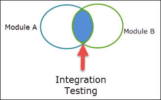
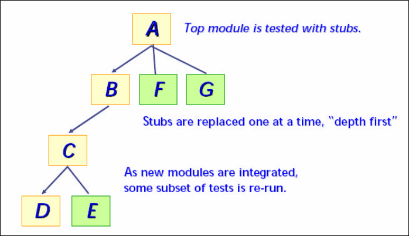
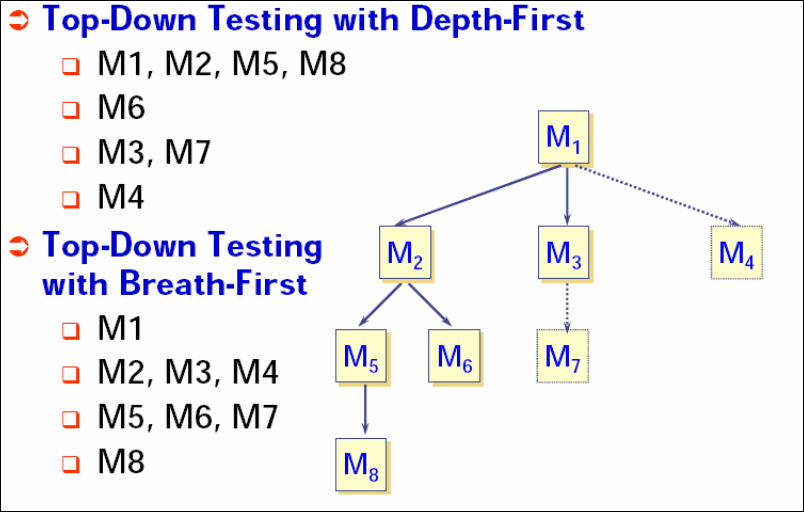
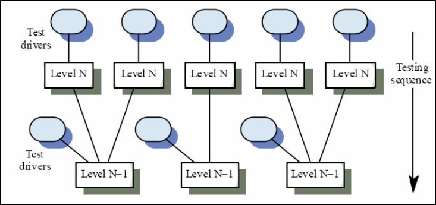

# 系统集成测试（SIT）：完整教程

## 系统集成测试是什么？

系统集成测试是指在一个集成的硬件和软件环境中进行测试以验证完整系统的行为的一种类型的测试。这是一个完整的，集成的系统进行测试，以评估系统的符合其规定的要求。

系统集成测试（SIT）进行验证的软件系统的模块之间的相互作用。它涉及高和低层次的软件要求中指定的软件需求规格/数据和软件设计文档的验证。

它也验证了软件系统的共存和测试软件应用程序的模块之间的接口。在这种类型的测试中，模块首先单独测试，然后组合成一个系统。

在这里，软件和/或硬件组件相结合，并逐步测试，直到整个系统已被集成。

## 为什么要做系统集成测试

做系统集成测试是因为，

- 它有助于及早发现缺陷
- 个别模块的可接受性的早期反馈将是可用的
- 缺陷修复的调度是灵活的，它可以与开发重叠
- 正确的数据流
- 正确的控制流
- 正确的时机
- 正确使用存储器
- 正确的软件要求

## 系统集成测试的方法

这是一个系统的技术，构建程序结构，同时进行测试，以发现与接口相关的错误。

所有模块都被集成，再将整个项目作为一个整体来进行测试。但在这个过程中，可能会遇到一组错误。

纠正这种错误是困难的，因为隔离的原因是复杂的巨大扩张的整个程序，一旦这些错误被纠正和纠正，一个新的将出现，并继续无缝地在一个无休止的循环。为了避免这种情况，使用另一种方法，增量集成。我们将在后面的教程中看到更多关于增量方法的细节。

有一些增量的方法，如集成测试系统上进行的目标处理器，所使用的方法是黑盒测试，无论是自下而上或自顶向下集成可以使用。

测试用例定义软件的高级需求。

软件集成也可以在宿主环境中实现，目标环境中的特定单元将继续在宿主中进行模拟。

在这个级别的确认测试将识别特定于环境的问题，如内存分配和分配的错误。在主机环境进行软件集成的实用性将取决于特定目标的功能是存在的。对于一些嵌入式系统与目标环境的耦合很强，使其在宿主环境进行软件集成不切实际。

大型软件开发将软件集成划分为多个层次，较低层次的软件集成主要基于主机环境，软件集成的后期水平越来越依赖于目标环境。

**注：**如果软件只被测试被称为软件集成测试 (SSIT),如果软件和硬件都被测试，那么它被称为软硬件集成测试 (HSIT)。

## 集成测试 ETVX 标准

通常在执行集成测试, ETVX (进入标准、任务、验证和出口准则)策略。

### 进入标准：

- 单元测试完成

### 输入：

- 软件需求数据
- 软件设计文件
- 软件验证计划
- 软件集成文件

### 活动：

- 基于高和低级别需求创建测试用例和规程
- 结合低级别的模块构建，实现一个通用的功能
- 开发测试框架
- 测试的构建
- 一旦测试通过，生成将与其他构建相结合，并进行测试，直到系统整体集成。
- 重新执行基于目标处理器平台的所有测试，并获得结果

### 退出准则：

- 成功完成对目标硬件的软件模块的集成
- 根据要求指定软件的正确性能

### 输出

- 集成测试报告
- 软件测试用例和流程(SVCP)。

## 硬件到软件集成测试

它是计算机的软件组件的测试(CSC)运行在目标计算机的环境，对高层次的功能。它集中在目标环境下开发的集成软件的行为。

### 基于要求的硬件-软件集成测试

基于需求的软硬件集成测试的目的是确保目标计算机中的软件能够满足高层次的要求，这种测试方法所揭示的典型错误包括：

- 硬件/软件接口错误
- 违反软件分区。
- 无法通过内置测试检测故障
- 对硬件故障的错误响应
- 由于测序，瞬态输入负载和输入功率瞬变的错误
- 反馈回路不正确行为
- 内存管理硬件错误或不当控制
- 数据总线争用问题
- 不正确操作的机制的正确性和兼容性验证现场可加载软件

硬件软件集成涉及高层次需求的验证，在这个级别上的所有测试都在目标硬件上进行。

- 黑盒测试是在这个级别的测试使用的主要测试方法。
- 仅从高级要求定义测试用例
- 测试必须在生产标准硬件上执行(目标)

### 事情要考虑在设计 HW/SW 的集成测试用例

- 正确采集所有数据的软件
- 缩放和预期的数据范围，从硬件到软件
- 正确的输出数据从软件到硬件
- 数据规格内(正常范围)
- 数据规格外(异常范围)
- 边界数据
- 中断处理
- 定时
- 正确的内存使用（寻址，重叠等）
- 状态转换

**注：**对于中断测试，所有的中断都会从最初的请求中独立验证，通过全面的维护和完成，测试用例将被专门设计，以充分测试中断。

## 软件到软件集成测试

它是在主机/目标计算机中运行的计算机软件组件的测试

环境，模拟整个系统(其他公司)，并在高级功能。

重点对 CSC 的行为在一个模拟的主机/目标环境。用于软件集成的方法可以是一种渐进的方式（自上而下、自下而上的方式，或两者的组合）。

## 增量方法

增量测试是集成测试的一种方法。在这种类型的测试方法，你的第一个测试软件的各个模块，然后继续添加其他模块，然后再测试等。

增量集成是大爆炸方法的对比，该程序是构造和测试的小片段，其中错误更容易隔离和正确的接口更可能被完全测试，并可能会采用一个系统的测试方法。

有两种类型的增量测试

- 自顶向下的方法
- 自下而上的方法

## 自顶向下方法

在这种方法中，个体开始通过测试用户界面，与底层的功能模拟的存根，然后向下移动整合低层如下图所示。

- 从主控模块开始，模块通过向下控制层次进行集成
- 将主控模块的子模块以广度优先或深度优先的方式并入结构中。
- 深度优先集成将结构的主要控制路径上的所有模块集成在如下图中：

模块集成过程按以下方式完成：

1. 所述主控模块作为测试驱动程序，并将取代所有的存根模块直接从属于主控制模块。
2. 下属的存根一次更换一个模块，这取决于实际的方法(选择广度优先或深度优先）。
3. 每个都作为模块集成。
4. 在每个实验中，另一存根模块替换为真正完成对每一测试
5. 为确保新的错误没有被回归分析测试可以被执行。

这个过程持续了从第二步直到整个程序的结构。自上而下的策略听起来比较简单，但在实践中，物流问题。

其中最常见的问题出现在当处理低级别需要充分测试级别上。

存根代替低层模块在自顶向下测试的开始，因此没有明显的数据可以在程序结构上向流。

## 测试可能面临挑战：

- 延迟试验直到存根与实际模块代替。 
- 开发存根，执行有限功能，模拟实际的模块。
- 集成的软件层次结构的向上。

**注：**第一种方法使我们失去了一些具体的测试和特定模块之间的对应关系的控制，这可能会导致错误的原因难以确定，往往违反了高度约束性的自上而下的方法。

第二种方法是可行的，但可能导致显著的开销，作为存根变得越来越复杂。

## 自下而上法

自下而上的集成在程序结构中以模块的最低级别开始构建和测试，在这个过程中，模块从底层集成到顶层。

在这种方法中处理模块的下属一定要求总是可用的，消除了需要的存根。

这种集成测试过程中执行的一系列的四个步骤

- 将低级别模块组合成执行特定软件子功能的群集。
- 编写驱动程序以协调测试用例输入和输出。
- 集群的构建或测试。
- 驱动程序被移除，并且集群在程序结构中向上移动。

为整合向上移动，独立的测试车手的需要减少。事实上，如果程序结构顶部的两级集成自上而下，驾驶员的数量可以大幅度降低，整合集群大大简化。整合的模式如下图示。集成向上移动，独立的测试车手的需要减少。

**注：**如果最上层的程序集成结构是自上而下的，驾驶员的数量可以显著减少，和集成的构建大大简化。

## 宇宙大爆炸的方式

在这种方法中，所有模块都没有集成，除非所有的模块都准备好了。一旦他们准备好了，所有的模块集成，然后执行它知道所有的集成模块是否工作。

在这种方法中，很难知道失败的根本原因，因为整合了所有的东西。

此外，将有很高的机会在生产环境中的发生关键错误。

只有在进行集成测试时才能采用这种方法。

## 总结：

- 集成进行验证的软件系统的模块之间的相互作用。它有助于及早发现缺陷
- 集成测试可以用硬件-软件或硬件-硬件集成
- 集成测试是通过两种方法完成
        - 增量方法
        - 宇宙大爆炸的方式
- 在进行集成测试一般 ETVX（入口准则、任务、验证和退出标准）策略应用。