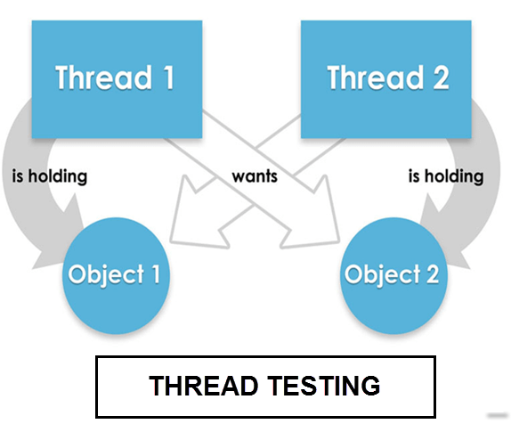

# 线程测试：类型、策略和多线程

## 什么是线程测试？

线程测试是测试特定任务（线程）的关键功能能力的一种测试技术。它通常是在集成测试阶段的早期阶段进行的。

基于线程的测试是系统集成测试中采用的增量策略之一。这就是为什么，线程测试应该更恰当地称为“**线程交互测试**”。

## 线程测试的类型

基于线程的测试分为两类

- **单线程测试：**单线程测试一次涉及一个应用程序事务
- **多线程测试：**多线程测试涉及多个同时活动的事务

## 线程测试的测试策略

线程过程关注的是集成活动，而不是整个开发生命周期。

- 基于线程的测试是基于会话的测试的一种通用形式，因为会话是线程的一种形式，但线程不一定是会话。
- 对于线程测试，线程或程序（小功能）作为一个子系统进行集成和增量测试，然后执行整个系统。
- 在最低的水平，它提供了集成商更好地了解测试的范围
- 而不是直接测试软件组件，它需要集成商集中在整个系统的上下文中测试逻辑执行路径。

## 用于多线程测试的技巧

- 通过反复执行不同的应用程序混合来测试多线程程序
- 通过同时拥有多个程序实例来测试多线程程序
- 在不同的硬件模型上执行多线程程序，具有不同的应力水平和工作负载
- 代码审查
- 只收集在主线程以外的线程中发生的错误和故障

## 线程测试的挑战

- 对于多线程测试，最大的挑战是你应该能够为单元测试编写可重复测试
- 为多线程代码编写单元测试是一个挑战性的任务
- 多线程测试的测试标准不同于单线程测试。多线程测试各种不同的因素如内存大小、存储容量、时间等问题，而在不同的硬件。

## 总结：

- 线程测试是验证特定任务的关键功能能力的一种技术
- 基于线程的测试分为两类
    - 单线程检测
    - 多线程测试