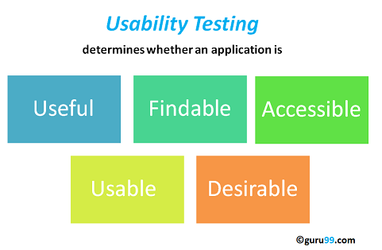

# 可用性测试教程：需要，过程，最佳实践

## 什么是可用性测试？

可用性测试是软件测试的类型，其中，设置一个小的目标，翻译软件的系统，使用该可用性来暴露缺陷。本试验主要研究了以使用者易于使用的应用，控制和处理能力的灵活性的系统以满足其目标。它也被称为用户体验测试。

该测试被建议在最初设计的 SDLC 阶段给出了更多的可见度的期望的用户。

## 可用性测试需要

 

美学和设计是重要的。产品通常看起来越好确定它如何工作越容易。

有许多以失败收场的软件/网站，一旦成功，由于以下原因：

- 我要在那里点击？
- 该导航页面需求？
- 该术语或图标代表什么？
- 错误信息和有效显示
- 会议时间不足够。

可用性测试的可用性确定系统中误差发生在早期发展的周期并可以从失败中保存产品。

## 可用性测试的目标

 本试验的目标是满足用户，它主要涉及以下参数：

### 该系统的有效性

- 该系统是容易学吗？
- 该系统是有用和有价值的目标受众吗？
- 是内容、颜色、图标、图像的审美愉悦呢？

### 最高使用率

- 导航到期望的画面/网页应该非常小。滚动条不能频繁使用。  
- 均匀性装祯设计出版物的在屏幕的应用程序/网页/网站。
- 提供可以搜索到你网站或应用程序软件

### 准确性

- 没有过时或不正确数据/地址等联系信息。
- 没有断了联系。

### 用户方便性

- 使用控制应该是自解释性的，并且必须不要求来操作训练  
- 应提供用于帮助用户理解应用程序/网站
- 上述目标有助于有效的可用性测试

## 可用性测试过程

可用性测试过程包括以下几个阶段

- 计划：在此阶段对可用性测试的目标是确定的。具有志愿者坐在前面的应用程序和记录他们的行动并不是目标。你需要确定目标和关键功能的系统。您需要将任务指派给您的测试人员，行使这些关键功能。在此阶段中，可用性测试，可用性的人口统 数 & 测试人员、测试，确定报告格式都需要确定。
- 招聘：在这个阶段，你的招募的测试者的数量需要按照你的可用性测试计划。寻找匹配你的人口统计的测试员(年龄、性别等）和教育（专业、工作等）需要时间。
- 可用性测试：在此阶段中，可用性测试的实际执行。
- 数据分析：从数据可用性测试的详尽分析，以取得有意义的推论给出具有可操作性的建议和改善总体可用性的产品。
- 制表：可用性测试的结果分享给所有相关的利益攸关方，包括设计师、开发人员、客户和 CEO 

## 可用性测试的方法

有两种方法可用来做可用性测试-

- 实验室可用性测试
- 远程可用性测试      

实验室可用性测试：这种测试是在一个单独的实验室室中存在的观察员。测试人员被分配执行的任务。观察者的角色是监视测试人员的行为并报告测试结果。观察者在测试过程中保持沉默。这个测试的测试人员和观察员均存在于相同的物理位置。

远程可用性测试：本观察员和测试人员位于远处。测试人员的测试访问系统，远程执行指定的任务。测试仪的声音、活动画面、表情都由测试人员通过自动化软件记录。观察员分析该数据并报告结果的测试。类似这样的软件有[http://silverbackapp.com/](http://silverbackapp.com/)

## 你需要多少用户?

研究( virzi，尼尔森在 1992 年 & Landauer 在 1993)表明：5 个用户足够发现 80% 的可用性问题。一些研究者认为是其他数量。

事实是，用户所需的实际数目取决于给定应用的复杂性和可用性目标。参与者的可用性增加导致成本，规划，管理和分析数据提高。

但作为一般方针，如果你的预算且感兴趣的 5 个 DIY 可用性测试是一个很好的起点。如果预算不是约束其咨询经验丰富的专业人员来确定最佳数量的用户。

## 最佳做法-可用性测试

目的通过临床随机对照试验发现可用性问题的关键是在产品发布之前。为了使测试成功，一下事情需要被考虑：

- 在早期的设计与开发的时候开始测试
- 在开始开发之前，对竞争对手的产品进行可用性测试是很好的做法。这将帮助您确定您的目标受众的可用性标准。
- 选择适当的用户测试系统(可以被非专家用户/专家/ 50-50 的专家和非专家用户）
- 使用的带宽。例如，具有较差目标受众的网络连接，网络限制带宽为 56 kbps 的可用性测试。
- 测试人员需要集中于关键和使用频繁的功能系统。  
- 分配一个单一的观察员到每个测试仪。这有助于观察者准确地注意测试员的行为。如果一个观察员被分配给多个测试人员，结果可能会受到损害。
- 教育设计人员和开发人员测试，此结果不是失败的迹象，但这是个好转迹象

## 可用性测试的利弊：

作为与生活中，可用性测试有其优劣势。让我们看看他们

### 优点：

- 它有助于发现可用性问题的产品进行销售。
- 它有助于提高终端用户的满意度
- 这让你的系统非常有效和高效
- 它真的可以帮助收集目标观众的反馈，他们在实际地使用系统可用性测试。你不需要依赖随机的人的“意见”

### 缺点：

- 成本是可用性测试需要主要考虑的。可用性测试实验室需要很多的资源。招聘与管理测试人员的可用性也可能是昂贵的

然而，这些费用以较高的客户满意度、保留和重复业务的形式支付。因此高度推荐可用性测试。