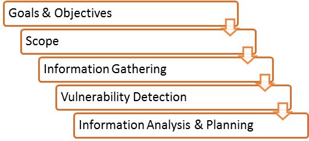
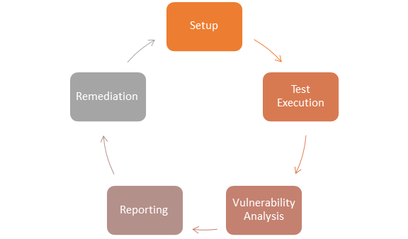

# 脆弱性测试:过程、评估、工具、扫描仪

一个漏洞是任何错误或弱点，在系统的安全程序，设计，实施或任何内部控制，可能会导致违反系统的安全策略，换句话说，入侵者（黑客）获得未经授权的访问的可能性。

在本教程中，您将学习-

- 什么是脆弱性评估

- 脆弱性评估过程

- 脆弱性的方法

- 漏洞扫描的类型

- 漏洞扫描的工具

- 脆弱性评估的优点

- 脆弱性评估的缺点

- 比较的脆弱性评估和渗透测试

- 脆弱性测试的方法 

## 什么是脆弱性评估

脆弱性评估是一种软件测试技术，以评估系统中所涉及的风险的突然增加，以减少事件的概率。

它依赖于两种机制：

### 1. 脆弱性评估

### 2. 渗透测试

### 为什么要进行脆弱性评估

- 这对组织的安全是非常重要的。
- 定位和报告的漏洞的过程，它提供了一种方法来检测和解决安全问题，通过排名的漏洞之前，有人或某事可以利用他们。
- 在这个过程中的操作系统，应用软件和网络进行扫描，以确定漏洞的发生，其中包括不适当的软件设计，不安全的身份验证等。

## 脆弱性评估过程

1. **目标：**定义脆弱性分析的目标

2. **作用域：**在进行测试和评估，其范围需要明确界定。

    以下是三种可能存在的范围：

    - [黑盒测试](http://www.guru99.com/black-box-testing.html)：从没有内部网络和系统的先验知识的外部网络进行测试。
    - 灰盒测试：从外部或内部网络测试，了解内部网络和系统。这是黑盒测试和白盒测试的结合。
    - [白盒测试](http://www.guru99.com/white-box-testing.html)：在内部网络与内部网络的知识和系统测试。也称为内部测试。

3. **信息搜集：**获得尽可能多的信息，例如网络环境、IP 地址、操作系统版本等。它适用于所有的三种类型的作用域，例如黑盒测试、白盒测试和灰盒测试

4. **漏洞检测：**在此过程中，使用漏洞扫描器，它将扫描它的环境并且将识别的漏洞。

5. **信息分析与规划：**它将分析所识别的漏洞，制定一个计划，渗透到网络和系统。

## 脆弱性的方法

### 1. 设置：

- 开始文件
- 安全许可
- 更新工具
- 配置工具

### 2. 执行测试：

- 运行工具
- 将捕获的数据分组(分组数据单元被路由的起点和目的地之间。当任何 e-mail 消息(文件、HTML 文件、统一资源定位符( URL )请求等)从一个地方到另一个在互联网上的 TCP 层的 TCP/IP 将文件分割为多个“块”的有效路由，并且每个块将被唯一编号，并将包括目的地的互联网地址。这些块也被称为分组。当他们都已经到了，他们将被重新集合为原始文件的 TCP 层接收，而运行评估工具

### 3. 漏洞分析：

- 定义和分类系统或网络的资源。
- 把优先级分配给该资源（如：高、中、低)
- 识别潜在的威胁。
- 制定一项战略来处理最优先考虑的问题。
- 如果发生攻击,定义和实施方法，以尽量减少后果。

### 4. 报告

### 5. 修复：

- 修复漏洞的过程。
- 对于每个漏洞

## 漏洞扫描的类型

### 1. 基于主机

- 标识主机或系统中的问题。
- 该方法通过使用基于主机和扫描仪的脆弱性诊断。
- 基于主机工具的软件将加载到目标系统；将跟踪并报告事件的安全分析师。

### 2. 基于网络 
- 它将检测打开端口，并识别在这些端口上运行的未知服务。然后它将可能与这些服务相关的脆弱性。
- 这个过程是通过使用基于网络的扫描器。

### 3. 基于数据库

- 它将确定使用的工具和技术来防止 SQL 注入的数据库系统的安全风险。（ SQL 注入：注入的 SQL 语句到数据库中的恶意用户，它可以读取敏感数据从数据库和更新数据库中的数据。）

## 漏洞扫描的工具

| 种类 | 工具 | 作图 |
|:----|------|----:|
| 基于主机 |	STAT |	扫描在网络的多个系统。|
|  | TARA |	老虎分析研究助理。|
|  | Cain&Abel | 通过嗅探网络恢复密码，破解HTTP密码。|
|  | Metasploit | 开发、测试和开发代码的开源平台。 |
| 基于网络 |	Cisco 安全扫描器	| 诊断和修理安全问题。 |
|  | Wireshark	| 开放源代码的网络协议分析器，用于 Linux 和 Windows。 |
|  | Nmap | 免费开源工具的安全审核。 |
|  | Nessus	| 无代理审计、报告和补丁管理集成。 |
| 基于数据库 | SQL diet | 字典攻击工具为 SQLServer。 |
|  | 安全审核员	| 允许用户在 OS上 执行枚举、扫描、审计和渗透测试和取证。 |
|  | DB-扫描	| 数据库木马检测，通过基线扫描检测隐藏木马。 |

## 脆弱性评估的优点

- 开源工具可用。
- 识别几乎所有脆弱性
- 用于自动扫描。
- 定期运行。

## 脆弱性评估的缺点

- 假阳性率高
- 可以容易地检测到入侵检测系统防火墙。
- 常常未能注意到最新的漏洞。

## 比较的脆弱性评估和渗透测试

|   ----  | 脆弱性评估 | 渗透检验 | 
|:-------|-----------|--------:|
| 作用 |	发现漏洞	| 鉴定和利用 |
| 作用原理 | 发现 & 扫描 |	模拟 |
| 关注 | 从广度到深度 | 从深度到广度 |
| 覆盖的完整性 |	高	| 低 |
| 造价 	| 低-中等 | 高 |
| 通过执行 |在创作团队	| 攻击者或笔检测仪 |
| 测试员的知识 |	高	| 低 |
| 多久运行一次 | 每个设备加载后 | 一年一次 |
| 结果 | 提供局部细节漏洞	| 提供完整的细节漏洞 |

## 脆弱性测试的方法 

### 动态测试

- 无效测试，测试仪介绍新的试验数据和分析结果等。

- 在测试过程中，测试人员创建一个心理模型的过程中，它会进一步增长，在互动的软件测试。

- 在进行测试，测试仪会积极主动的融入进程的新思想和新的测试案例。这就是为什么它被称为有源测试。

## 被动测试

- 被动测试、监测结果的软件下运行而不引入新的测试或测试案例或数据

## 网络测试

- 网络测试是在一段时间内测量和记录网络运行状态的过程。
- 测试主要用于预测网络负载下运行或发现新服务所产生的问题。
- 我们需要测试网络的以下特性：

1.利用水平

2.数量

3.使用应用

## 分布式测试

- 分布式测试用于测试分布式应用程序，这意味着应用程序同时与多个客户机一起工作。基本上，测试分布式应用程序意味着分别测试它的客户端和服务器部分，但使用分布式测试方法，我们可以一起测试它们。
- 测试部分将在测试过程中相互影响。这使得它们以适当的方式同步。同步是分布式测试中最关键的问题之一。

## 结论

脆弱性测试依赖于两种机制即漏洞评估和渗透测试。这些测试是彼此不同的强度和任务执行。然而，为了实现全面报告脆弱性测试，两种程序的组合。