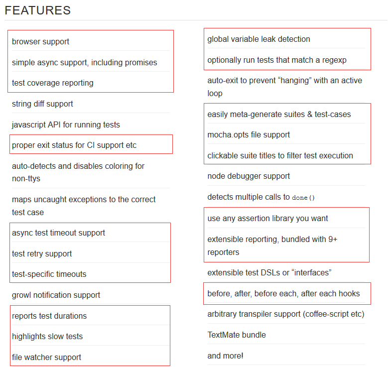

# 课程说明

【幻灯片：封面】  
各位小伙伴大家好，一门新的课程，《基于 mocha 的自动化测试框架》，终于和大家见面了。

## 前置课程

【前置课程】  
学习本门课程之前，需要小伙们具备软件测试的基础知识，如果小伙伴们不具备这方面的知识，建议小伙伴们学习《初级自动化测试工程师》套餐课程，并完成相应的通关任务。

学习本门课程之前，需要小伙伴们具备软件配置管理的相关知识，如果小伙伴们不具备这方面的知识，建议小伙伴们学习《配置管理之 Git 分布式版本控制系统从入门到精通》套餐课程，并完成相应的通关任务。

学习本门课程之前，需要小伙伴们具备 JavaScript 开发的基础，以及 nodejs 应用开发的基础，我计划在下半年推出这方面的课程。

另外，本课程的教学和演示是基于 Linux 系统完成的，需要小伙伴们对 Linux 操作系统的使用有所了解，后续我也会推出这方面的课程，小伙伴们可以对我的课程保持关注。我的学员 QQ 群号是：301862163，我每次发布新课程的时候，都会在群里发布公告，欢迎同学们加群，大家抱团取暖，共同进步和提高。加群的时候最好说明一下自己正在学习的课程名称。

下面打开 51CTO 学院王顶老师的课程主页，把刚才这两个课程套餐，给小伙伴们看一眼，如果大家需要的话，可以根据需要有选择性的学习。可能有的小伙伴会问，我不具备你刚才说的这些基础知识，可不可以学习这个课程啊？可以的。因为，本课程不是纯理论教学，属于案例实战教学，教学过程中涉及到的概念和案例，尽可能安排的简单并且容易理解。你先学习本课程，在学习的过程中，发现欠缺一些知识，再回头去补也行。所以，学习的方式和方法是因人而异的，不是一个模式，一成不变的。

## 是什么？

首先，先简单介绍一下 mocha 是什么。

咱们先打开 mocha 的官方网站，给小伙伴们介绍一下 mocha 是什么、mocha 能做什么，以及 moacha 的优势。

【打开 Mocha 官网】  
从官方网站上我们能看到，Mocha 是非常简单的（simple）、灵活的（flexible）和有趣的（fun）测试框架。Mocha 诞生于 2011 年，是现在最流行的 JavaScript 测试框架之一，在浏览器和 Node 环境都可以使用。所谓"测试框架"，就是运行测试的工具。通过它，可以为 JavaScript 应用添加测试，从而保证代码的质量。他有很多的功能特性，网站上给我们了一个清单和列表，我们可以大致过一下，这些特性我们的课程中大部分都会讲到。本课程会全面介绍如何使用 Mocha，让你轻松上手。如果你以前对测试一无所知，本课程也可以当作 JavaScript 单元测试入门。值得说明的是，除了 Mocha 以外，类似的测试框架还有 Jasmine、Karma 和 Tape 等，也很值得学习。



## 为什么学习？

下面跟小伙伴们聊聊为什么要讲这么一门课程。自从 16 年下半年我在 51CTO 学院发布了 Selenium IDE web 自动化测试系列课程之后，【在 51CTO 学院看一下这几门课程】小伙伴们一直在追着，让我讲全代码的 web driver 自动化测试课程。经过了一段时间的准备，现在条件基本上成熟了。本课程就是全代码的自动化测试课程，选用的编程语言是 JavaScript。web driver 自动化测试市面上的书或者网上的教程大多是用 Java 语言或者 Python 语言讲的。因为，我对前端和后端网站开发比较赶兴趣，另外，GitHub 上 JavaScript 是排名第一的语言。因此，我就选用 JavaScript 来讲自动化测试，跟大家也有所区别，换句话说，51CTO 学院现在用 JavaScript 来讲自动化测试的仅此一家。而 mocha 是 JavaScript 自动化测试框架中应用最广泛的一种。所以，我就从 Mocha 开始讲起，因为没有自动化测试框架，直接讲 web driver 不能完全发挥出 web driver 的能力。一般来说，我们用 Java 结合 web driver 做自动化测试，一定会用到 TestNG 单元测试框架，如果用 Python 来做 web driver 自动化测试，一定会用到 Python 自带的单元测试框架。如果用 JavaScript 来做自动化测试，Mocha 框架是必须要用到的，这是绕不过去的。Mocha 的作用相当于 Java 中的 JUnit 或者 TestNG。其实 mocha 自动化测试框架，既可以用来做单元测试，也可用来做功能测试，也可以做 TDD（测试驱动开发），或者 BDD（行为驱动开发）。

【幻灯片 测试框架图】  
小伙伴们可以看一下幻灯片上的这幅图，自动化测试有三个主要应用场景，他们分别是：自动化单元测试、自动化接口测试和自动化 web ui 测试。你会看到 Mocha 作为自动化测试框架来说，他的作用是基础性的。这就意味着，Mocha 既可以做自动化单元测试，也可以做自动化接口测试，甚至可以做 WEB UI 的自动化功能测试。咱们这个《基于 mocha 的自动化测试框架》这三种自动化测试场景都会讲到。像 web 接口测试和 webdriver 整合的 web ui 测试的内容，我们会安排在下篇课程中。

另外，就是为什么不选择 Java 或者 Python 而选择 JavaScript 语言来做自动化测试，这里要给小伙伴们做一个说明，其实这里面我是有想法的。刚才也提到了，JavaScript 语言是 GitHub 开源社区中排名第一的编程语言，这个小伙伴们学过 GitHub 开源之旅第一季：Git 入门的课程，你就知道了，我在课程里面拿出 GitHub 2016 年的年度报告给小伙伴们分析过，JavaScript 语言非常有前途。而且 npmjs.org 网站，现在已经是最大的包共享的网站了，我们用 JavaScript 开发，有很多第三方的库和包可以选择，这样可以帮助我们快速完成应用的构建。另外，一点我们经常做网站的自动化测试，网站的前端就是 HTML、CSS 和 JavaScript，如果我们用 JavaScript 做自动化测试，必然要求我们掌握 JavaScript 编程语言，这样我们可以很容易的介入到开发的网站代码里面。这对我们的测试工作是有好处的。另外，JavaScript 的功能非常强大，使用 JavaScript 语言，基本上我们可以开发网站、可以做手机 app 的混合应用开发，甚至可以做桌面带窗口的应用程序，大家可能知道 atom 编辑器就是 JavaScript 开发的。当然，JavaScript 写个命令行程序更是不在话下了，现在很多前端开发的自动化构建工具，都是用 JavaScript 结合 NodeJS 开发的。所以，JavaScript 可以构建的应用程序形态是多种多样的，掌握了 JavaScript 一门语言，我们基本上什么应用程序都可以做出来。所以，我选择用 JavaScript 语言来讲自动化测试，是考虑将来小伙伴们可能会去转做开发，这样我们的适应面会更广一些，路子更宽一些，更有利于自己的职业发展，或者能更容易的把握各种职业发展中的机遇。

以上这些就是开设这门课程的缘由以及技术选型的背景。接下来在给小伙伴们介绍这门课程的教学计划和教学安排之前，我先给小伙伴们演示一下基于 Mocha 的自动化测试是怎么一个玩法，大家先有一个大概的印象和认识，以便你来决定是否需要学习这门技术。换句话说，我们学完这门课程之后，我们能够做什么？

```bash
# 我这里有一个 connect 开源项目

# 进到项目目录
cd connect
ls

# 自动化测试脚本放在 test 文件夹下面
cd test
ls

vim app.listen.js
# 再打开几个其他自动化测试的脚本文件

# 在 xshell 的窗口平铺下面，在另一个命令行运行测试
npm test

# 自动化测试执行完毕
```

总结：当我们学完本门课程之后，我们会掌握基于 Mocha 的自动化测试脚本如何编写。当然，这些自动化测试脚本可以和持续集成环境结合使用，这里我就不再演示了。刚才我们测试的项目是一个中间件项目，我们也可以用 Mocha 结合 Selenium web driver 来测试网站的 UI 功能，这里也就不再演示了，后面的课程我们都会讲到。当然，通过这门课程小伙伴们还会学到，这种基于 Linux 和 vim 集成开发环境的高效开发方式。这是很多互联网公司或者很多技术大牛们使用的开发方式。

## 课程安排

【思维导图：上篇和下篇的课程大纲】  
【幻灯片：课程安排】   
下面跟小伙伴们介绍一下这门课程的教学计划和安排。首先，咱们的课程分成上、下两部，现在咱们讲的是上篇。咱们的课程安排尽量符合大家学习和认知规律，也就是从易到难，从简单到复杂，让小伙伴们容易接受和掌握，帮助小伙伴们快速入门。上篇课程主要介绍 Mocha 的一些基本用法，让大家先热热身，熟悉一下 Mocha 的玩法。下篇课程再讲一些有难度的话题，比如：Mocha 与持续集成的整合，Mocha 与代码覆盖工具的整合，Mocha 与 web driver web UI 测试的整合，等等。当然，上篇是基础，只有上篇 Mocha 的基础掌握好了，咱们才能更好地深入到下篇的技术话题中。上篇的课程安排，如课程大纲所示：包括六个话题，咱们现在讲的是课程说明，第一个话题。接下来是开发环境搭建以及被测项目的创建，正式的测试内容是第三个话题到第六个话题，这是咱们上篇课程的重点。当然，前面的开发环境搭建以及被测项目的创建对于后面内容的更好地展开也是非常有必要的补充和铺垫。

## 课程资料

还是一如既往的，咱们的课程资料放到了 GitHub 王顶的个人主页下的 course 仓库的 mocha 文件夹。大家可以访问这个路径或者扫描屏幕上的二维码来获取课程资料。

## 学习方法

学习方法还是老生长谈，再强调一下哦。如果大家学习的目的，仅仅是想了解一下 mocha，可以 1.5 倍速快速观看视频，大致浏览和了解一下。反过来，如果大家想真正掌握这个技术，最好看完视频后，认真的完成通过任务，而且在观看视频的同时，尽可能的记一下笔记。保证有一个好的学习效果。

## 通关任务

最后，本小节的通关任务如下：

略。

