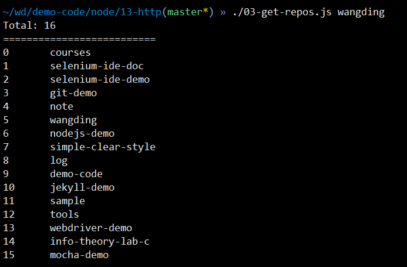
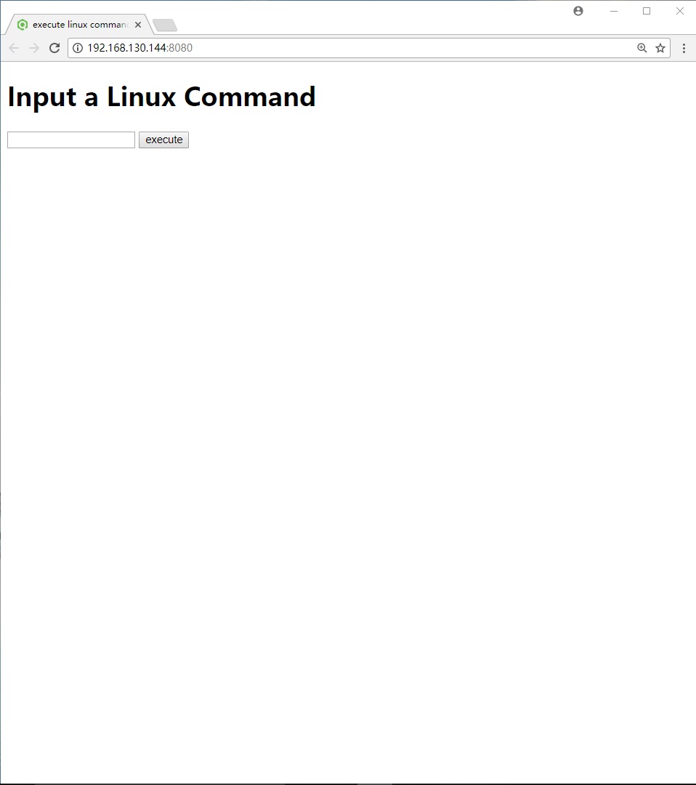

# 中篇闯关任务

## 任务一：文件系统：同步/异步操作

要求：  
- 阅读[文件 API 资料](http://nodejs.cn/api/fs.html)  
- 阅读[文件资料](http://javascript.ruanyifeng.com/nodejs/fs.html)  
- 将 fs 模块中的函数分类整理成思维导图，附：[参考答案](http://naotu.baidu.com/file/74c2915d47a4e7ae561b9f57940865c3?token=743a4bf398643762)  
- 创建 10-file-system 目录 
- 编写 01-my-cat-async.js 脚本  
- 编写 01-my-cat-lower.js 脚本  
- 编写 01-my-cat-mix.js 脚本  
- 编写 01-my-cat-stream.js 脚本  
- 编写 01-my-cat-sync.js 脚本  
- 编写 01-my-cp.js 脚本，要求如下：  
  - 除了能复制文件内容，还需要复制文件权限  
  - 用 fs 模块的底层 API 实现 01-my-cp-low.js  
  - 用 fs 模块的同步 API 实现 01-my-cp-sync.js  
  - 用 fs 模块的异步 API 实现 01-my-cp-async.js  
  - 用 fs 模块的底层和高级 API 实现 01-my-cp-mix.js  
  - 用 fs 模块的流 API 实现 01-My-cp-stream.js  
- 编写 01-my-mv.js 脚本  
- 编写 01-my-rm.js 脚本  
- 编写 01-my-touch.js 脚本  
- 编写 02-my-ls.js 脚本  
- 编写 02-my-mkdir.js 脚本，要求如下：  
  - 用 fs 模块的同步 API 实现 02-my-mkdir-sync.js  
  - 用 fs 模块的异步 API 实现 02-my-mkdir-async.js  
- 编写 02-my-rm-dir.js 脚本  
- 编写 03-my-ln.js 脚本  
- 编写 03-read-lnk.js 脚本  
- 编写 04-my-chmod.js 脚本  
- 编写 04-my-chown.js 脚本  
- 编写 04-my-stat.js 脚本  
- 编写 05-watch.js 脚本  
- 编写 06-my-rm.js 脚本  

## 任务二：网络：分布式应用基础

要求：  
- 阅读 [net API 资料](http://nodejs.cn/api/net.html)  
- 阅读 [net 资料](http://javascript.ruanyifeng.com/nodejs/net.html)  
- 创建 11-tcp 目录
- 编写 01-server.js 脚本  
- 编写 02-my-telnet.js 脚本  
- 阅读 [dgram API 资料](http://nodejs.cn/api/dgram.html)  
- 创建 12-udp 目录  
- 编写 01-server.js 脚本  
- 编写 02-my-nc.js 脚本  
- 阅读 [http API 资料](http://nodejs.cn/api/http.html)  
- 阅读 [http 资料](http://javascript.ruanyifeng.com/nodejs/http.html)  
- 创建 13-http 目录  
- 编写 01-server.js 脚本  
- 编写 02-my-crul.js 脚本  
- 编写 03-get-weather.js 脚本，实现以下功能：  
  - 调用天气预报 API，实现城市天气查询：https://www.jisuapi.com/api/weather/  
  - 用 GET 方法请求天气信息  
- 编写 03-get-repos.js 脚本，实现以下功能：  
  - 获取某个账户的所有 GitHub 仓库的数量和名称  
  - API 地址：`https://api.github.com/search/repositories?q=user:wangding`  
  - API 参考：https://developer.github.com/v3/
  - 运行效果如下图所示：  
  -   
- 编写 04-post.js 脚本  
- 编写 04-post-weather.js 脚本，实现以下功能：
  - 调用天气预报 API，实现城市天气查询：https://www.jisuapi.com/api/weather/  
  - 用 POST 方法请求天气信息  
- 阅读 [dns API 资料](http://nodejs.cn/api/net.html)  
- 创建 14-dns 目录
- 编写 01-dns.js 脚本  

## 任务三：子进程：执行外部程序

要求：
- 阅读 [child_process API 资料](http://nodejs.cn/api/child_process.html)  
- 阅读 [child_process 资料](http://javascript.ruanyifeng.com/nodejs/child-process.html)  
- 创建 15-child-process 目录  
- 编写 01-exec-file.js 脚本，请实现以下功能：  
  - 可以执行任何一个外部程序  
  - 命令行参数中有需要执行的外部程序以及外部程序的参数  
  - 如果没有命令行参数，执行 cat 命令，打印 01-exec-file.js 脚本文件内容  
  - 外部程序运行的正确信息打印在控制台上  
  - 外部程序运行的错误信息打印在控制台上  
  - 测试用例 1：执行 `./01-exec-file.js`，预期结果：控制台打印 01-exec-file.js 文件内容  
  - 测试用例 2：执行 `./01-exec-file.js mkdir abc`，预期结果：当前目录下创建 abc 文件夹  
  - 测试用例 3：执行 `./01-exec-file.js mkdir abc`, 预期结果：报错，abc 文件夹已存在  
  - 测试用例 4：执行 `./01-exec-file.js ls -l / /usr /var`，预期结果：长格式输出根目录、/usr 和 /var 三个目录的内容  
  - 测试用例 5：执行 `./01-exec-file.js abc`，预期结果：报错，Error: spawn abc ENOENT  
- 编写 02-spawn-v1.js 脚本  
- 编写 02-child.js 脚本  
- 编写 02-exec-file.js 脚本  
- 编写 02-spawn-v2.js 脚本  
- 编写 02-spawn-v3.js 脚本  
- 编写 02-spawn-v4.js 脚本  
- 编写 03-exec.js 脚本  
- 编写 04-detach.js 脚本  
- 编写 05-fork.js 脚本  
- 编写 05-ipc-child.js 脚本  
- 编写 05-ipc.js 脚本  
- 编写 06-sync.js 脚本  

## 任务四：web 应用：更轻、更快

要求：  
- 阅读 [HTTP 协议资料](https://en.wikipedia.org/wiki/Hypertext_Transfer_Protocol#Message_format)  
- 阅读 [HTTP 协议入门](http://www.ruanyifeng.com/blog/2016/08/http.html)  
- 阅读 [HTTP 头部字段资料](https://en.wikipedia.org/wiki/List_of_HTTP_header_fields)  
- 用 chrome 访问 [one-div.html](http://sample.wangding.in/web/one-div.html)，查看请求和响应的头信息，如下图所示：  
  - 搞明白请求头部字段列表中每个字段的含义和作用  
  - 搞明白响应头部字段列表中每个字段的含义和作用  
  -   
- 阅读 [HTTP 状态码资料](https://en.wikipedia.org/wiki/List_of_HTTP_header_fields)  
- 创建 16-web 目录  
- 编写 01-basic-server.js 脚本  
  - 设置状态码  
  - 设置响应头字段信息  
- 编写 02-static-http-server.js 脚本，实现以下功能：
  - 用命令行参数指定静态文件服务的根路径，要求：  
    - 支持相对路径，例如：`./02-static-http-server.js ../13-http`  
    - 支持绝对路径，例如：`./02-static-http-server.js ~/wd`  
  - 文件找不到时，脚本程序不能崩溃，应该给客户端返回 404 错误或者 404 错误页面  
  - 运行以下命令，获取静态页面，对脚本程序进行测试：  
    - `wget http://sample.wangding.in/nodejs/index.html`  
    - `wget http://sample.wangding.in/web/one-div.html`  
    - `wget http://sample.wangding.in/testing/triangle.html`  
    - `wget http://sample.wangding.in/testing/triangle.css`  
    - `wget http://sample.wangding.in/testing/triangle.js`  
    - `wget https://raw.githubusercontent.com/fex-team/kityminder/dev/favicon.ico`
- 编写 03-form.js 脚本，实现查询和增加待办事项的功能  
- 编写 03-form-html.js 脚本，实现 03-form.js 的功能，但是有以下要求：  
  - 将 03-form.js 脚本中的 HTML 代码，保存在单独的文件中 template.html，内容如下：  
  - 03-form-html.js 程序读取 template.html 模板文件，并将占位符 % 替换为具体的待办事项数据  
```html
<!DOCTYPE html>
<html>
  <head>
    <meta charset="UTF-8">
    <title>Todo list</title>
  </head>
  
  <body>
    <h1>Todo List</h1>
    <form method="post" action="/">
      <p><input type="text" name="item" id="item"/>
      <input type="submit" value="Add Item" /></p>
    </form>
    <ul>%</ul>
  </body>
</html>
```
- 编写 03-form-cmd.js 脚本，要求实现以下功能：  
  - 基于 03-form.js 程序框架  
  - 用户在表单中提交 linux 命令  
  - 服务程序利用子进程技术执行 linux 命令  
  - 服务程序将 linux 命令的运行结果返回到网页上  
  - 命令运行结果要求能够正确的换行显示  
  - 程序的运行效果，如下图所示：  
  -   
- 阅读[理解 RESTful 架构](http://www.ruanyifeng.com/blog/2011/09/restful.html)  
- 阅读 [RESTful API 设计指南](http://www.ruanyifeng.com/blog/2014/05/restful_api.html)  
- 编写 04-rest-api.js 脚本  
- 阅读 [fetch 官方文档](https://fetch.spec.whatwg.org/)  
- 阅读 [fetch 用法说明](http://blog.csdn.net/kajweb/article/details/72593482)  
- 编写客户端代码使用 RESTful API  
  - 执行 `wget http://sample.wangding.in/nodejs/todo.html` 命令，获取网页 html 代码  
  - 在页面上实现查询和增加代办事项的功能  
  - 在页面上实现删除和修改代办事项的功能  
- 阅读 [https API 资料](http://nodejs.cn/api/https.html)  
- 编写 05-https-server.js 脚本  

## 任务五：测试：保证代码质量

要求：  
- 阅读 [assert API 资料](http://nodejs.cn/api/assert.html)  
- 阅读 [assert 资料](http://javascript.ruanyifeng.com/nodejs/assert.html)  
- 创建 17-test 目录  
- 编写 todo.js 脚本  
- 编写 todo.test.js 脚本  

## 任务六：调试  

要求：  
- 用 JSHint 工具检查自己写过的所有代码，改正代码中问题  
- 练习使用 node.js 命令行调试器  
- 练习使用 chrome 的图形界面调试器，调试 server.js 程序，去掉程序中的 bug    
  - 获取 server.js 脚本程序，运行：`wget http://sample.wangding.in/nodejs/server.js`  
- 练习使用 node.js 性能分析工具  

