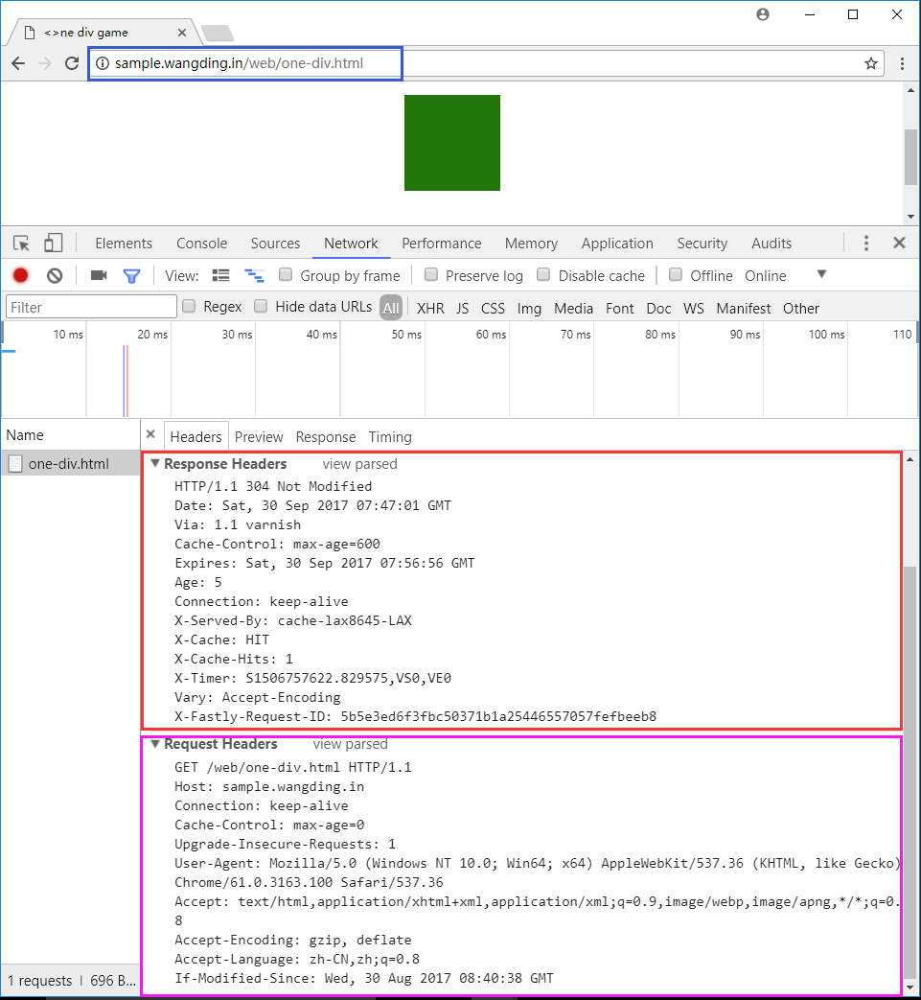

# 中篇闯关任务

## 任务一：文件系统：同步/异步操作

要求：  
- 阅读[文件 API 资料](http://nodejs.cn/api/fs.html)  
- 阅读[文件资料](http://javascript.ruanyifeng.com/nodejs/fs.html)  
- 创建 10-file-system 目录 
- 编写 01-my-cat-async.js 脚本  
- 编写 01-my-cat-lower.js 脚本  
- 编写 01-my-cat-mix.js 脚本  
- 编写 01-my-cat-stream.js 脚本  
- 编写 01-my-cat-sync.js 脚本  
- 编写 01-my-cp.js 脚本  
- 编写 01-my-mv.js 脚本  
- 编写 01-my-rm.js 脚本  
- 编写 01-my-touch.js 脚本  
- 编写 02-my-ls.js 脚本  
- 编写 02-my-mkdir.js 脚本  
- 编写 02-my-rm-dir.js 脚本  
- 编写 03-my-ln.js 脚本  
- 编写 03-read-lnk.js 脚本  
- 编写 04-my-chmod.js 脚本  
- 编写 04-my-chown.js 脚本  
- 编写 04-my-stat.js 脚本  
- 编写 05-watch.js 脚本  
- 编写 06-my-rm.js 脚本  

## 任务二：网络：分布式应用基础

要求：  
- 阅读 [net API 资料](http://nodejs.cn/api/net.html)  
- 阅读 [net 资料](http://javascript.ruanyifeng.com/nodejs/net.html)  
- 创建 11-tcp 目录
- 编写 01-server.js 脚本  
- 编写 02-my-telnet.js 脚本  
- 阅读 [dgram API 资料](http://nodejs.cn/api/dgram.html)  
- 创建 12-udp 目录
- 编写 01-server.js 脚本  
- 编写 02-my-nc.js 脚本  
- 阅读 [http API 资料](http://nodejs.cn/api/http.html)  
- 阅读 [http 资料](http://javascript.ruanyifeng.com/nodejs/http.html)  
- 创建 13-http 目录
- 编写 01-server.js 脚本  
- 编写 02-my-crul.js 脚本  
- 编写 03-get-weather.js 脚本  
- 编写 04-post.js 脚本  
- 阅读 [dns API 资料](http://nodejs.cn/api/net.html)  
- 创建 14-dns 目录
- 编写 01-dns.js 脚本  

## 任务三：子进程：执行外部程序

要求：
- 阅读 [child_process API 资料](http://nodejs.cn/api/child_process.html)  
- 阅读 [child_process 资料](http://javascript.ruanyifeng.com/nodejs/child-process.html)  
- 创建 15-child-process 目录  
- 编写 01-exec-file.js 脚本  
- 编写 02-child.js 脚本  
- 编写 02-exec-file.js 脚本  
- 编写 02-spawn-v1.js 脚本  
- 编写 02-spawn-v2.js 脚本  
- 编写 02-spawn-v3.js 脚本  
- 编写 02-spawn-v4.js 脚本  
- 编写 03-exec.js 脚本  
- 编写 04-detach.js 脚本  
- 编写 05-fork.js 脚本  
- 编写 05-ipc-child.js 脚本  
- 编写 05-ipc.js 脚本  
- 编写 06-sync.js 脚本  

## 任务四：web 应用：更轻、更快

要求：  
- 阅读 [HTTP 协议资料](https://en.wikipedia.org/wiki/Hypertext_Transfer_Protocol#Message_format)  
- 阅读 [HTTP 协议入门](http://www.ruanyifeng.com/blog/2016/08/http.html)  
- 阅读 [HTTP 头部字段资料](https://en.wikipedia.org/wiki/List_of_HTTP_header_fields)  
- 用 chrome 访问 [one-div.html](http://sample.wangding.in/web/one-div.html)，查看请求和响应的头信息，如下图所示：  
  - 搞明白请求头部字段列表中每个字段的含义和作用  
  - 搞明白响应头部字段列表中每个字段的含义和作用  
  -   
- 阅读 [HTTP 状态码资料](https://en.wikipedia.org/wiki/List_of_HTTP_header_fields)  
- 创建 16-web 目录  
- 编写 01-basic-server.js 脚本  
  - 设置状态码  
  - 设置响应头字段信息  
- 编写 02-static-http-server.js 脚本，运行以下命令，获取静态页面：  
  - `wget http://sample.wangding.in/nodejs/index.html`
  - `wget http://sample.wangding.in/web/one-div.html`
  - `wget http://sample.wangding.in/testing/triangle.html`
  - `wget http://sample.wangding.in/testing/triangle.css`
  - `wget http://sample.wangding.in/testing/triangle.js`
  - `wget https://raw.githubusercontent.com/fex-team/kityminder/dev/favicon.ico`
- 编写 03-form.js 脚本  
  - 实现查询和增加待办事项的功能  
  - 实现删除和修改代办事项的功能  
- 阅读[理解 RESTful 架构](http://www.ruanyifeng.com/blog/2011/09/restful.html)  
- 阅读 [RESTful API 设计指南](http://www.ruanyifeng.com/blog/2014/05/restful_api.html)  
- 编写 04-rest-api.js 脚本  
- 阅读 [fetch 官方文档](https://fetch.spec.whatwg.org/)  
- 阅读 [fetch 用法说明](http://blog.csdn.net/kajweb/article/details/72593482)  
- 编写客户端代码使用 RESTful API  
  - 执行 `wget http://sample.wangding.in/nodejs/todo.html` 命令，获取网页 html 代码  
  - 在页面上实现查询和增加代办事项的功能  
  - 在页面上实现删除和修改代办事项的功能  
- 阅读 [https API 资料](http://nodejs.cn/api/https.html)  
- 编写 05-https-server.js 脚本  

## 任务五：测试：保证代码质量

要求：  
- 阅读 [assert API 资料](http://nodejs.cn/api/assert.html)  
- 阅读 [assert 资料](http://javascript.ruanyifeng.com/nodejs/assert.html)  
- 创建 17-test 目录  
- 编写 todo.js 脚本  
- 编写 todo.test.js 脚本  

## 任务六：调试  

要求：  
