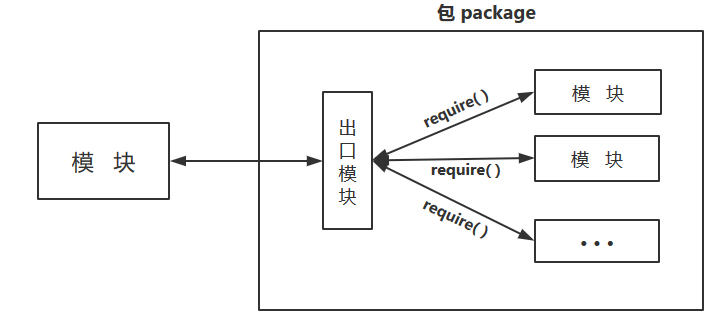

# node.js 第三次测验题和答案

## 一、全局：Buffer

1. Buffer 对象的用途是什么？  
```
处理二进制数据流
```
2. 如何实例化一个 Buffer 对象？
```
var buf = new Buffer();
```
3. Buffer 对象的填充方法是什么？  
```
fill();
```
4. 实例化 Buffer 的三种方法分别是什么？
```
1. 用一个数组来实例化 Buffer
2. 用字符串来实例化 Buffer
3. 拷贝旧的 Buffer
```
5. Buffer 支持的六种编码格式分别是什么？
```
ASCII码
UTF-8
UTF16le
base64 编码
binary 二进制编码
hex 十六进制编码
```
6. 把字符串转化成另一种编码格式用的方法是什么？
```
toString('codingName');
```
7. 在网页中内嵌图片的 HTML 代码是怎样的？
```
[;base64],<data>]' />
在 HTML 中嵌入图片的好处是，减少页面 HTTP 请求的数量。
```
8. 调用文件模块的语句是怎样的?
```
var fs = require('fs');
```
9. 调用 http 模块的语句是怎样的？
```
var http = require('http');
```
10. 计算机上的数据分为哪两种？
```
可读的纯文本数据
二进制数据
```
11. bmp 缩写于什么？
```
bit map
```
12. 如何从 linux 命令行获取网页上的图片？
```
在命令行输入：wget URL
```
13. 在 xshell 的 linux 命令行，怎样保存文件到 Windows 本机上？
```
在命令行输入：sz fileName
```
14. 位图二进制文件格式是怎样的？  
```
头信息 + 数据部分
```
15. 写入二进制数据用的是什么方法？
```
buf.writeXXX
```


## 二、全局：模块管理

1. node.js 中进行模块管理的全局对象有哪几个？分别是什么功能？  
```
require() 引用模块,export 暴露模块接口,module 代表当前模块
```
2. JS 模块化的两种方案是什么？
```
前端的：AMD
后端的：CommonJS
```
3. 什么时候要用 require()？  
```
引用非全局模块的时候
```
4. npm 是什么的缩写？有什么作用？
```
缩写于 Node Packaged Modules, 是 node.js 的模块管理器
```
5. 如何安装要使用的第三方模块？
```
在命令行输入：npm install moduleName
```
6. 使用 package.json 配置文件管理第三方模块的过程是怎样的？
```
1. 初始化一个 package.json 文件：npm init
2. 安装第三方模块：npm install moduleName -S(--save)
3. 发布程序和 package.json 配置文件
4. 使用时：运行 npm install 安装第三方模块
```
7. 删除一个文件夹的命令是什么？
```
rm -rf dirName
```
8. 用什么方法让别人可以使用我们自定义的模块？
```
module.exports = something
```
9. 怎样暴露模块中的一个变量？
```
module.exports = value;
```
10. 怎样暴露模块中的一个函数?
```
module.exports = function(){};
```
11. node.js 中 require() 返回的是什么？
```
是 exports 对象，或者是 module.exports 变量
```
12. 画图表示怎样加载一组相关的模块？  

13. node.js 中的顶层对象是什么？
```
global 对象
```
14. 前端中的顶层对象是什么？
```
window 对象
```
15. 查看 module 时，都包含哪些属性？  
```
id：模块的识别符，通常是带有绝对路径的模块文件名
exports：表示模块对外输出的值
parent：返回一个对象，表示调用该模块的模块
filename：模块的文件名，带有绝对路径
children：返回一个数组，表示该模块要用到的其他模块
loaded：返回一个布尔值，表示模块是否已经完成加载
```
