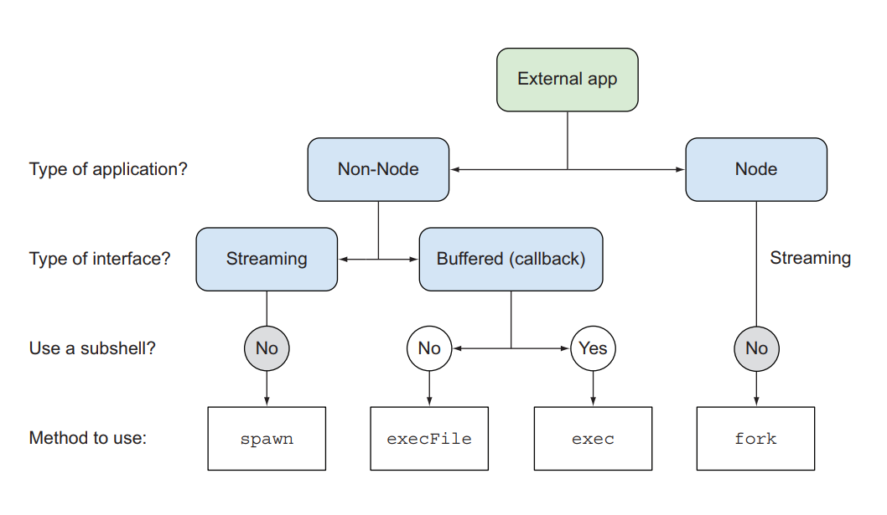

# node.js 第八次测验题和答案

## 一、子进程：执行外部程序

1. child_process 模块提供了哪四种不同的方法来执行外部应用程序？
```
child_process.execFile()
child_process.exec()
child_process.spawn()
child_process.fork()
```
2. 上述四种方法中唯一可以使用 subshell 的是哪个？
```
exec()
```
3. execFile 方法的语法格式是怎样的？
```
execFile(file[,args][,options][,callback])
```
4. execFile 方法调用外部程序，外部程序的执行结果放在哪里？
```
缓存中。
因此要等到外部程序执行结束后，才可以查看执行结果。
```
5. 查看所有环境变量的 Linux 命令是什么？
```
env
```
6. 查看路径环境变量的 Linux 命令是什么？
```
echo $PATH
```
7. 在 node.js 中如何查看路径环境变量？
```
process.env.PATH
```
8. 如何用 Linux 命令给路径环境变量增加目录？
```
PATH = $PATH:newDir
export PATH
```
9. 在用 execFile 方法调用外部程序时，可能出现的三种错误分别是什么？给出怎样的错误信息？
```
1. 调用的外部程序找不到：ENOENT
2. 调用的外部程序被占用：EPERM
3. 调用的外部程序被锁住（没有调用权限）：EACCES
```
10. spawn 方法的语法格式是怎样的？
```
spawn(command[,args][,options])
```
11. spawn 方法调用外部程序，外部程序的执行结果放在哪里？
```
被调用程序的输出流或错误流中。
因此可以用管道操作。
```
12. spawn 方法相比较 execFile 方法有什么优势？
```
可以实时获取外部程序的执行结果
而不是等到外部程序执行结束后再调用
```
13. 对文本进行排序的 Linux 命令是什么？
```
sort
```
14. 对文本去除重复的 Linux 命令是什么？
```
uniq
```
15. 用 spawn 方法实现对文本的排序去重该怎么操作？
```javascript
var cp = require('child-process');
var cat = cp.spawn('cat',['./messy.txt']);
var sort = cp.spawn('sort');
var uniq = cp.spawn('uniq');
cat.stdout.pipe(sort.stdin);
sort.stdout.pipe(uniq.stdin);
uniq.stdout.pipe(process.stdout);
```
16. exec 方法的语法格式是怎样的？
```
exec(command[,options][,callback])
```
17. exec 方法调用外部程序，外部程序的执行结果放在哪里？
```
缓存中
```
18. exec 方法相较前两种方法的特点是什么？
```
调用的命令和该命令所需的参数作为一个字符串参数传入
支持命令行的管道操作，重定向操作
```
19. 分离父子进程的操作原理是怎样的？
```
1. 使用 spawn 方法，设置它的第三个参数为：
{detached:true,stdio:['ignore',1,2]}
2. 不再把子进程的输出流和错误流接到父进程相应的流上
3. 父进程不再保留子进程的引用：child_process.unref(); 
```
20. fork 方法的语法格式是怎样的？
```
fork(modulePath[,args][,options])
```
21. fork 方法调用外部程序，外部程序的执行结果放在哪里？
```
被调用程序的输出流或错误流中
```
22. fork 方法相较前三种方法有怎样的特点？
```
1. 只能调用 Node.js 程序
2. 默认支持独立进程
3. 支持 IPC 进程通信
```
23. IPC 缩写于什么？
```
Inter-Process Communication 进程间通信
```
24. 前面四种方法都是异步的，前三种有相对应的同步方法，分别是什么？
```
child_process.execFileSync()
child_process.execSync()
child_process.spawnSync()
```
25. 请画出四种方法使用的决策树？  


