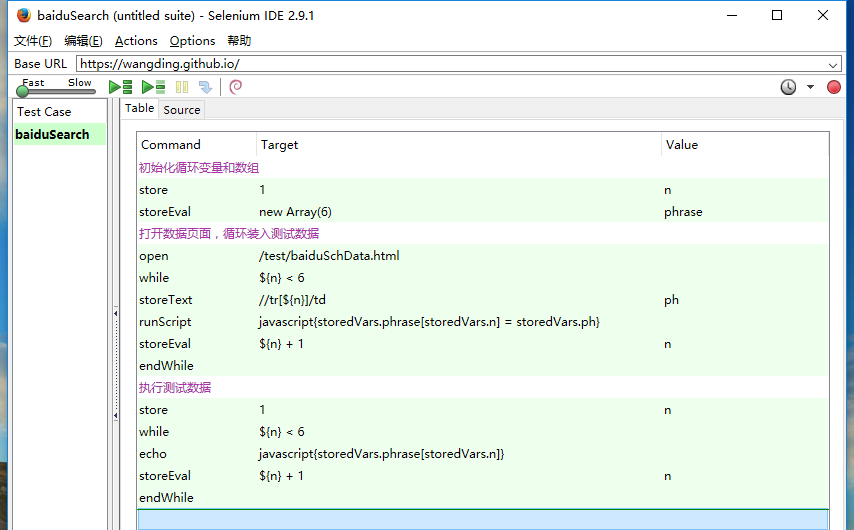
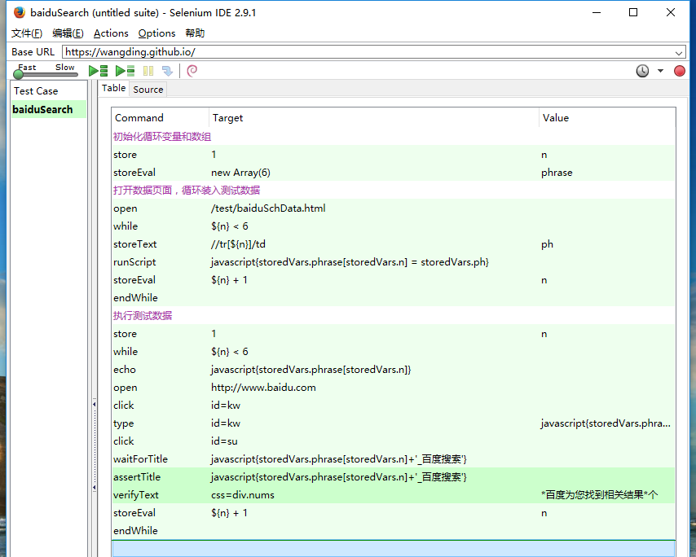

## 问题缘起
刘金梦同学在学习 Selenium IDE web 自动化测试课程下篇内容的时候，在 51CTO 学院的课程页面上提了一个问题。【把 51CTO 学院的问题页面打开】。

## 分析问题
- 问题提出，三种格式，本地文件，路径问题

## 解决方案
- 数据存到服务器上：
    - 方案一：数据库；
    这个方案 Selenium IDE 暂时不知道如何实现，可能需要写用户扩展的 js 脚本，去操作数据库。这个方案我们继续保持关注和探索。
    - 方案二：HTML页，Github + Github Page；
    方案二的思路得出并不复杂，因为我们已经有这样的经验了。我们制作的自动化测试脚本可以通过访问器类的命令，直接从被测网页上抓取数据。因此，我们就人为制造一个被测网页，这个网页上存放着我们的测试数据，我们把这个网页上的测试数据抓取下来。然后再打开真正的被测页面，把测试数据应用于测试过程。
    Github + Github Page，Github 让我们可以创建远程仓库，相当于是服务器上的文件夹，利用 Git 工具可以把网页代码提交到服务器上。Github Page 可以让我们的前端页面通过 URL 地址来访问。就相当于送给我们一个无限空间的 web 服务网站空间了。所以，我一直推荐大家学习 Github，好处太多了。我最近正在策划录制 Github 相关的课程，课程出来估计要一月份去了。

## 实现过程
- 如何实现？【分下面三个步骤来实现，这是迭代开发】
- 表格数据读取，echo 打印数据
- 表格数据读取放到数组里
- 数据读取结合业务逻辑测试
三个步骤：

### Step0：制作数据文件
- HBuilder 编辑 HTML 页面。以一个自动化测试脚本为模板，因为数据存放在网页表格中，我们之间在脚本的 HTML 代码上做修改。
- 利用 Git 工具上传 Github 仓库中。
- 用火狐打开数据页面，如下图所示：

### Step1：实现对页面中的数据获取
- 思路上没有难度，通过 Selene 的访问器类命令，就可以把数据放到变量里面，然后 echo 打印出来，印证数据获取的正确性。
- 首先，把表格的某行数据获取，并打印。
- 其次，增加循环控制，完成循环读取数据，并打印。
如下图所示：

### Step2：将获取的数据存放到数组中
- 实现后的代码如下图所示：

### Step3：将获取的数据存放到数组中
- 实现后的代码如下图所示：

### 最后的完善
如何把表格的行数信息参数化？
百度搜索“dom 如何得到表格行数”
得到：http://bbs.csdn.net/topics/340125500
在控制台中测试代码
在Selenium IDE中代码执行不成功
document.getElementsByTagName('tr').length
查找资料
window.document.getElementsByTagName('tr').length
成功
- 实现后的代码如下：

