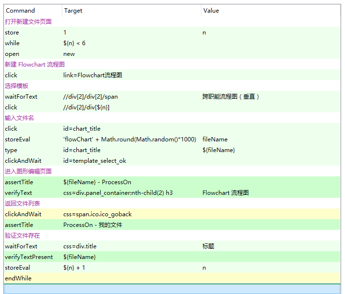
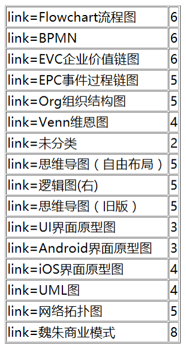
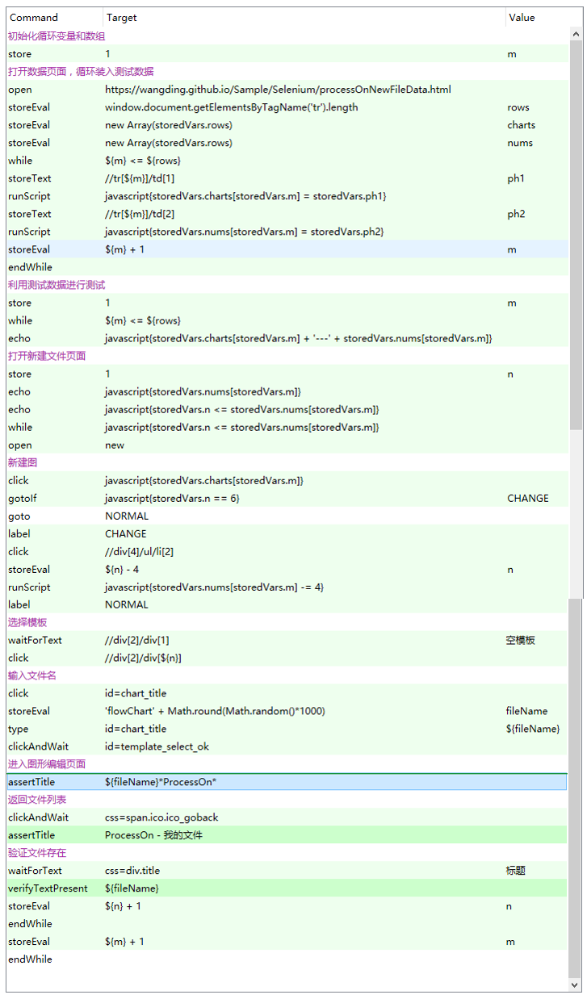

在介绍新的课程内容之前先对前面的几个视频中的问题做一下说明：
- 前面三个视频录制的分辨率过高，建议大家观看的时候在台式机或者笔记本上进行观看，在手机上基本上案例讲解中的自动化脚本是看不出清楚的。
- 大家在观看视频的时候请选择高清模式，这样案例讲解中的代码可能会看的稍微清楚一点儿，后面的课程已经做了调整，降低了视频录制的分辨率，保证大家能看清楚代码。
- 本来想对之前课程的视频进行重新录制，但是考虑到课程录制的现场感和成本的问题，最终放弃了重新录制。作为补救措施，在课程的 PPT 中，增加了每一个步骤自动化测试脚本的截图，这样大家直接下载 PPT 或者从 seIDE 仓库中找到相应的案例代码进行研究。【演示一下 PPT 中的变化】
- 对 HTML DDT 方案的作业做个说明。如果大家不具备 Git 和 Github 操作的技能，这个作业任务如何完成呢？两个办法，第一，制作的 HTML 数据文件放到本地，用 Selenium IDE 读取本地的 HTML 数据文件，然后再测试真正的被测网站。第二，我已经把四个网站的数据文件做好，放到了 Github 的 Sample 仓库下面，大家可以通过 URL 地址来访问。这个 URL 地址在 PPT 的作业任务下面有链接和文件名，注意，尽量复制粘贴地址，如果自己输入地址，大小写都不能写错，否则页面打不开。
- 对 HTML DDT 方案的优势说明一下，这个数据方案相比较 js、csv 和  xml 这三种数据方案有哪些优势呢？有三点优势：1. 数据文件制作非常容易；2. 结合 Github 和 Github Pages 数据文件很容易部署到互联网上；3. 也是最重要的一个方面，这种数据文件的读取操作，不需要借助任何额外的插件，并且不需要在 Selenium IDE Options 选项对话框中进行设置。所以，我现在做 DDT 的方案，一般都选用 HTML 格式的数据文件。

## 问题缘起
我们在 Selenium IDE web 自动化测试入门上中下三篇课程结束的时候，给大家布置了一个大作业，综合案例实训的任务。对 ProcessOn 网站的文件和文件夹管理功能做自动化测试。这个作业任务在 Github 上能访问到。【把综合实训作业页面打开】。为什么要安排这样一个综合实训案例呢？主要基于以下的考虑。

我们课程中也提到过，因为录制视频的原因，不能让每节课程的时长过大。所以，我们讲解技术细节时举的案例都尽可能的简单，比如：百度搜索、手机号归属地查询或者时间校准网，这样的我们可以把焦点集中到技术本身，而不是被网站功能的业务逻辑搞得晕头转向。即使我们讲了一个复杂一些的网站，例如：hostedredmine 网站，我们也是对其中的一小部分功能，issue 的 CRUD 做了一个自动化脚本，很多其他功能都没有录制。意思是一样的，都是为了保证课时的短小精悍。

但是，上中下三篇的课程学完之后，我们就不能仅限于能做一些小的自动化脚本了。基于这个考虑，我们给大家设计了综合实训案例，这个案例也只是网站的一小部分功能，只是文件和文件管理功能，暂时不涉及别的功能。这样一个规模大一些的任务布置下去后，大家需要动真格的， 就会碰到各种各样的问题，而这些问题又能促进我们更进一步的学习和提高，彻底搞明白 Selenium IDE 中的技术细节，并且能进行综合运用。而且这样大规模的任务，也促使我们去思考自动化测试脚本如何组织，如何安排。

如果这个作业任务，大家才听说，没有关系，这个作业任务的地址，我刚才演示的时候给大家提示了，你最好在下面完成一下。当然，先打个预防针，这个任务不是一天两天能完成的，你需要先做出思维导图来，估算一下项目范围和工作量，然后给领导报告，你的计划和进度安排。

这里我把学生做好的黑盒测试案例设计的思维导图地址，给大家展示一下：xxx。

同学们在完成这个任务的过程中反映了很多问题，这里面拿 ProcessOn 文件的新建功能为例，把完整的脚本制作过程展示给大家。脚本制作的过程我们采用采取迭代式增量开发，保证每一个步骤，增加一点儿代码，增加的一点儿代码尽可能逻辑简单，回放后确保能正常使用。我们在逐步推进的过程中，会复现同学们碰到的问题，并且给大家分析问题的背景，以及解决方案。

## step1：录制脚本并回放

说明：这一步完成起来一点儿都没有难度。但是一回放问题一大堆，碰到的第一个问题是弹窗。所以，我们在上篇课程就提到，我们称为制作脚本，制作脚本包括的动作：录制脚本、编辑脚本和调试脚本。如果我们只会录制脚本就完了，以为录制出来的脚本，很可能就跑不通。这就需要我们能够调试和编辑脚本。这里面我们看到一个 waitForPopup 我们看命令的英文单词，我们就知道了，这是一个弹窗。可是注意啊，这个弹窗，我们在下篇课程中讲过三种弹窗，Alert 警告弹窗，Prompt 提示弹窗和 Confirmation 确认弹窗。这种弹窗不属于这三种弹窗，这是普通的浏览器窗口形式的弹窗。弹窗在火狐浏览器中被设置为用新标签页打开弹窗，然后，后续的操作都是在新标签页的弹窗中进行的。这里面我们需要做窗口切换操作，否则，脚本会在之前的窗口中，执行后续的脚本，当然定位器参数都找不到的。而处理弹窗的命令就是 selectWindow 我们已经把这个命令的参考信息截取到 PPT 上了。

## setp2：selectWindow 命令及 open URL

我们通过增加 selectWindow 命令可以让之间的脚本跑通了，但是，我们发现其实刚开始的 URL 和新建文件窗口的 URL 不同，其实，我们可以通过 URL 直接到达新建文件的页面。所以，我们直接把 open 命令的 URL 修改为新建文件的 URL。

## step3：单一功能跑通

## step4：文件名参数化

## step5：第一重循环，遍历模板

## step6：定位器参数化

## step7：第二重循环，遍历2文件类型

