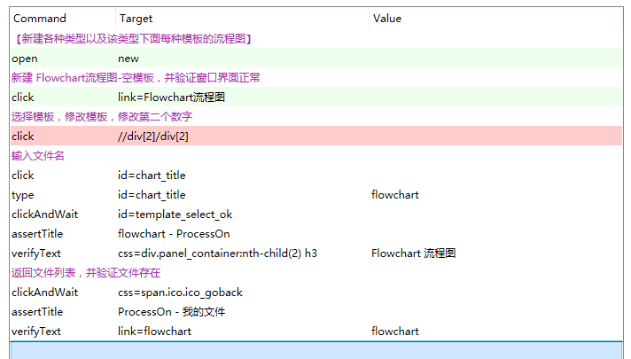
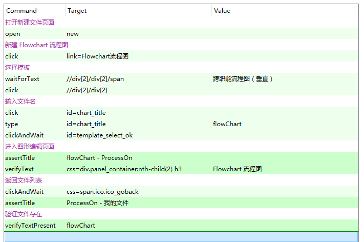
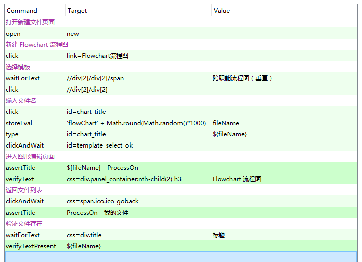
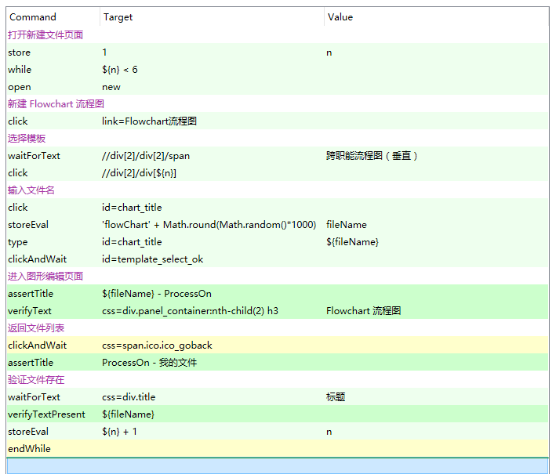

在介绍新的课程内容之前先对前面的几个视频中的问题做一下补充说明：
- 前面三个视频录制的分辨率过高，建议大家观看的时候在台式机或者笔记本上进行观看，在手机上基本上案例讲解中的自动化脚本是看不出清楚的。
- 大家在观看视频的时候请选择高清模式，这样可能案例讲解中的代码会看的稍微清楚一点儿，后面的课程已经做了调整，下调了视频录制的分辨率。
- 本来想对之前课程的视频进行重新录制，但是考虑到课程录制的现场感和成本的问题，所以放弃了重新录制。作为补救方案，在课程的 PPT 中已经，增加了每一个步骤的自动化测试脚本的截图，这样大家直接下载 PPT 或者从 seIDE 仓库中找到相应的案例代码进行研究。【演示一下 PPT 中的变化】
- 对 HTML DDT 方案的作业做个说明，如果大家不具备 Git 和 Github 操作的技能，这个作业如何做呢？两个办法，第一，制作的 HTML 数据文件放到本地，用 Selenium IDE 预先读取本地的 HTML 数据文件，然后再测试真正的被测网站。第二，我已经把四个网站的数据文件做好，放到了 Github 的 Sample 仓库下面，大家可以通过 URL 地址来访问。这个 URL 地址在 PPT 的作业任务下面有链接和文件名，注意，尽量复制粘贴地址，如果输入地址，大小写都不能写错，否则页面打不开。
- 对 HTML DDT 方案的优势说明一下，这个数据方案相比较 js、csv 和  xml 这三种数据方案有哪些优势呢？

## 问题缘起
我们在 Selenium IDE web 自动化测试入门上中下三篇课程结束的时候，给大家布置了一个大作业，综合案例实训的任务。对 ProcessOn 网站的文件和文件夹管理功能做自动化测试。这个作业任务在 Github 上能访问到。【把综合实训作业页面打开】。为什么要安排这样一个综合实训案例呢？基于以下的考虑。

我们课程中也提到过，因为录制视频的原因，不能让每节课程的时长过大。所以，我们讲解技术细节的时候举的案例都尽可能的简单，比如：百度搜索、手机号归属地查询或者时间校准网，这样的我们可以把焦点集中到技术本身，而不是被网站功能的业务逻辑搞得晕头转向。即使我们讲了一个复杂一些的网站，例如：hostedredmine 网站，我们也是对其中的一小部分功能，issue 的 CRUD 做了一个自动化脚本，很多其他功能都没有录制。意思是一样的，都是为了保证课时的短小精悍。

但是，上中下三篇的课程学完之后，我们就不能仅限于能做一些小的自动化脚本了。基于这个考虑，我们给大家设计了综合实训案例，这个案例也只是网站的一部分功能，只是文件和文件管理功能，暂时不涉及别的功能。这样一个规模大一些的任务布置下去后，大家需要动真格的，  就会碰到各种各样的问题，而这些问题又能促进我们更进一步的学习和提高，彻底搞明白 Selenium IDE 中的技术细节，并且能进行综合运用。而且这样大规模的任务，也促使我们去思考自动化测试脚本如何组织，如何安排。

如果这个作业任务，大家才听说，没有关系，这个作业任务的地址，我刚才演示的时候给大家提示了，你最好在下面完成一下。当然，先打个预防针，这个任务不是一天两天能完成的，你需要先做出思维导图来，估算一下项目范围和工作量，然后给领导报告，你的计划和进度安排。

这里我把学生做好的黑盒测试案例设计的思维导图地址，给大家展示一下：xxx  
学生在完成这个任务的过程中反映了很多问题，这里面我捡两个典型的问题给大家分析一下。第一个问题，相对简单。

问题1：selectWindows

问题2：脚本快速回放不通过，其实这个问题我们在案例三还会讲到，没有关系，这个问题我们重复多讲两边都没有关系，关键是大家一定要这地掌握和搞透，否则，我们学到的东西就不实用，不能给企业解决真正的问题。

在窗口中操作界面，看 firebug 代码区域的变动，推测这是前端代码的效果。

得出的宝贵原则：操作界面元素，一定要保证该界面元素出现在网页上。

解决的步骤：

## step0：

## setp1：

## step2：

## step3：

